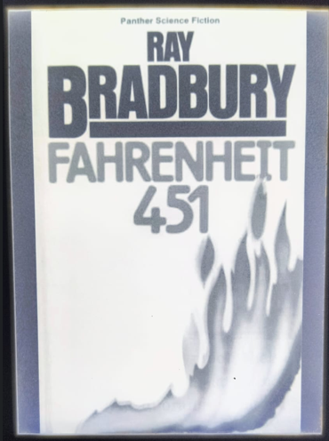
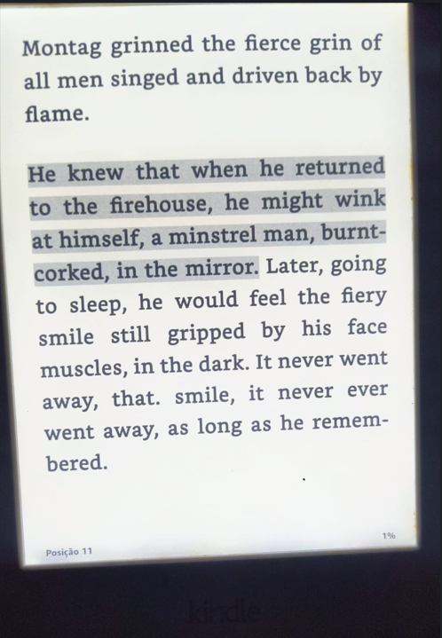
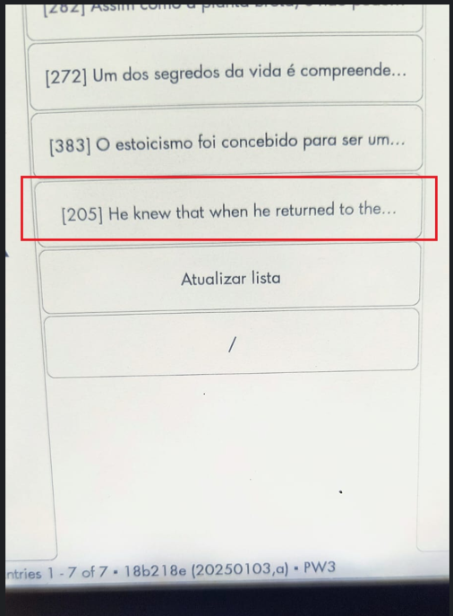
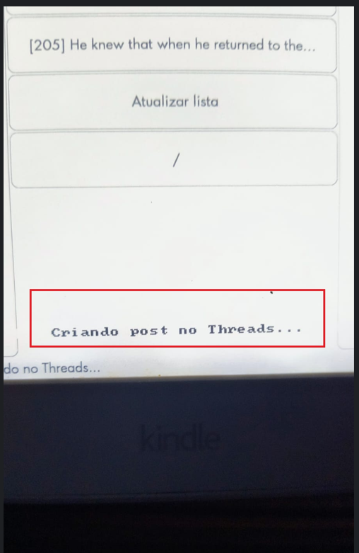
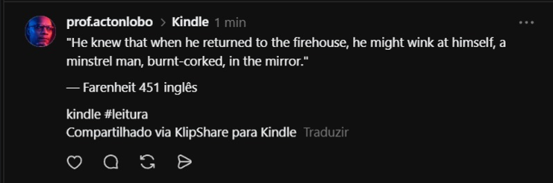

# KlipShare para Kindle

[](https://github.com/sponsors/lordlobo1)
[](https://github.com/lordlobo1/KlipShare/commits/main)
[](LICENSE)
[](https://www.mobileread.com/forums/showthread.php?t=203326)

**Compartilhe seus destaques de leitura no Threads e Twitter/X, sem sair do Kindle.**

KlipShare é uma extensão para o [KUAL](https://www.mobileread.com/forums/showthread.php?t=203326) (Kindle Unified Application Launcher) que lê os destaques salvos no `My Clippings.txt` e publica automaticamente no [Threads](https://www.threads.net) e no [Twitter/X](https://x.com) com um toque — sem abrir o celular, sem copiar e colar.

---

## Em ação

<p align="center">
  
  &nbsp;
  
  &nbsp;
  
  &nbsp;
  
  &nbsp;
  
</p>

<p align="center"><em>Leia → destaque → selecione no menu → publicado no Threads em segundos.</em></p>

---

## Funcionalidades

- **Publicação com um toque** — selecione o destaque no menu e ele é postado imediatamente
- **Threads + Twitter/X simultâneos** — um toque posta nas duas plataformas ao mesmo tempo (Twitter é opcional)
- **Truncamento independente por plataforma** — Threads usa até 500 chars; Twitter usa até 280 (ou mais, para usuários X Premium)
- **Feedback diferenciado** — a tela do Kindle avisa quando o tweet foi encurtado para caber no limite
- **Formatação automática** — o post é gerado no formato `"trecho" — Livro #kindle #leitura`
- **Limpeza de títulos** — remove metadados de e-books (z-library, [PDF], emojis, parênteses duplicados)
- **Capitalização inteligente** — capitaliza a primeira letra, incluindo caracteres acentuados (á, é, ó...)
- **Indicador de caracteres** — exibe o tamanho estimado do post antes de publicar
- **Fila offline** — se o Kindle estiver sem WiFi, o post é salvo e enviado automaticamente na próxima conexão
- **Token persistente** — renovação automática dos tokens do Threads (60 dias) e Twitter/X (rotativo)
- **Suporte ao KOReader** — lê highlights do KOReader além do `My Clippings.txt` nativo
- **Até 30 destaques recentes** exibidos no menu

---

## Pré-requisitos

Antes de instalar, verifique se o seu Kindle atende a todos os requisitos abaixo.

### 1. Kindle com jailbreak

O KlipShare requer um Kindle desbloqueado (jailbreak). Modelos compatíveis e instruções estão disponíveis no [MobileRead Forum](https://www.mobileread.com/forums/showthread.php?t=346037).

**Como verificar:** conecte o Kindle ao computador. Se existir uma pasta `extensions/` na raiz do dispositivo, o jailbreak está ativo.

### 2. KUAL instalado (versão 2.x ou superior)

O KUAL (Kindle Unified Application Launcher) é o menu de extensões do Kindle. O KlipShare requer a versão **2.x ou superior**, que suporta menus em JSON e menus dinâmicos — recursos usados para exibir os destaques em tempo real.

**Como verificar:** na tela inicial do Kindle, procure por um livro chamado **"KUAL"** na biblioteca. Se aparecer, está instalado. Qualquer download recente do link abaixo já é a versão 2.x.

**Como instalar:** baixe em [MobileRead — KUAL](https://www.mobileread.com/forums/showthread.php?t=203326) e copie o arquivo `.azw2` para a pasta `documents/` do Kindle.

### 3. KOReader instalado

O KOReader fornece o programa `curl` que o KlipShare usa para se comunicar com a API do Threads.

**Como verificar:** abra o KUAL. Se aparecer a opção **KOReader**, está instalado.

**Como instalar:** baixe em [github.com/koreader/koreader](https://github.com/koreader/koreader/releases) e siga as instruções para Kindle.

### 4. Conta no Threads

Você precisa de uma conta ativa no [Threads](https://www.threads.net) para autorizar o app.

### 5. Conta no Twitter/X (opcional)

Para postar também no Twitter/X, você precisará de uma conta no [X (Twitter)](https://x.com). A configuração é feita separadamente após o Threads e é totalmente opcional — sem ela o KlipShare continua funcionando normalmente apenas no Threads.

---

## Instalação

### Passo 1 — Baixar o KlipShare

1. Acesse [github.com/lordlobo1/KlipShare](https://github.com/lordlobo1/KlipShare)
2. Clique no botão verde **Code**
3. Clique em **Download ZIP**
4. Extraia o arquivo ZIP no seu computador

O arquivo extraído terá esta estrutura:

```
KlipShare-main/
├── kindle/       ← pasta que vai para o Kindle
│   ├── bin/
│   │   ├── generate_menu.sh
│   │   └── share_threads.sh
│   └── config.xml
├── api/          ← servidor (ignorar)
├── setup/        ← servidor (ignorar)
└── vercel.json   ← servidor (ignorar)
```

### Passo 2 — Copiar para o Kindle

1. Conecte o Kindle ao computador via cabo USB
2. O Kindle aparecerá como um dispositivo de armazenamento (ex: `D:\` no Windows, `/Volumes/Kindle` no Mac)
3. Na raiz do Kindle, crie a pasta `extensions/klipshare/` se ainda não existir
4. Abra a pasta `KlipShare-main/kindle/` no computador
5. Copie **todo o conteúdo** de `kindle/` para dentro de `extensions/klipshare/` no Kindle

> ⚠️ Copie apenas o conteúdo da pasta `kindle/`. As pastas `api/`, `setup/` e o arquivo `vercel.json` são usados pelo servidor e **não devem ir para o Kindle**.

A estrutura final no Kindle deve ser exatamente esta:

```
Kindle/
└── extensions/
    └── klipshare/
        ├── config.xml
        ├── bin/
        │   ├── generate_menu.sh
        │   └── share_threads.sh
        └── config/               ← criar esta pasta manualmente
            └── credentials.conf  ← criado no Passo 4
```

6. Dentro de `extensions/klipshare/`, crie a pasta `config/` manualmente

### Passo 3 — Autorizar o KlipShare no Threads

Abra a página abaixo **no navegador do celular ou computador onde você está logado no Threads**:

**[https://klipshare.vercel.app/setup](https://klipshare.vercel.app/setup)**

1. Clique em **Autorizar com Threads**
2. Na tela do Threads, clique em **Continuar como @seu_usuario**
3. Aguarde — a página gera o conteúdo do `credentials.conf` automaticamente
4. Clique em **Copiar**

> A página não armazena nenhum dado. O token é gerado e exibido apenas para você.

<details>
<summary>Configuração manual — para quem não consegue usar a página acima</summary>

Esta etapa conecta o KlipShare à sua conta do Threads por linha de comando. Você precisará de dois dados:

- **User ID** — número que identifica sua conta na API do Threads
- **Access Token** — chave de acesso que autoriza o KlipShare a publicar em seu nome

#### 3.1 — Autorizar o KlipShare

Abra o link abaixo no navegador **onde você está logado no Threads**:

```
https://threads.net/oauth/authorize?client_id=1817010732620817&redirect_uri=https://klipshare.vercel.app/setup&scope=threads_basic,threads_content_publish&response_type=code
```

- O Threads mostrará uma tela pedindo permissão para publicar em seu nome
- Clique em **Continuar como @seu_usuario**
- Você será redirecionado de volta para a página de setup com o código na URL
- **Antes que a página carregue completamente**, olhe para a barra de endereços — ela estará assim:

```
https://klipshare.vercel.app/setup?code=AQBxxxxxxxxxxxxxxxxxxxxxxxx#_
```

Copie apenas o trecho entre `code=` e `#_`. Exemplo:
```
AQBxxxxxxxxxxxxxxxxxxxxxxxx
```

> ⚠️ Este código expira em **10 minutos**. Complete os passos seguintes sem demora.

#### 3.2 — Trocar o código pelo token de curta duração

**Windows (PowerShell):**

```powershell
curl.exe -X POST "https://graph.threads.net/oauth/access_token" `
  -d "client_id=1817010732620817" `
  -d "grant_type=authorization_code" `
  -d "redirect_uri=https://klipshare.vercel.app/setup" `
  -d "code=COLE_O_CODIGO_AQUI"
```

**Mac/Linux (Terminal):**

```sh
curl -X POST "https://graph.threads.net/oauth/access_token" \
  -d "client_id=1817010732620817" \
  -d "grant_type=authorization_code" \
  -d "redirect_uri=https://klipshare.vercel.app/setup" \
  -d "code=COLE_O_CODIGO_AQUI"
```

A resposta JSON terá este formato:

```json
{
  "access_token": "THAAAAxxxxxxxxxxxxxxxx",
  "token_type": "bearer",
  "expires_in": 3600,
  "user_id": 12345678901234567
}
```

Anote o `user_id` — este é o seu **User ID**. Copie o `access_token` — este é o **token de curta duração**.

#### 3.3 — Gerar token de longa duração (válido por 60 dias)

**Windows (PowerShell):**

```powershell
curl.exe "https://graph.threads.net/access_token?grant_type=th_exchange_token&access_token=TOKEN_CURTO"
```

**Mac/Linux (Terminal):**

```sh
curl "https://graph.threads.net/access_token?grant_type=th_exchange_token&access_token=TOKEN_CURTO"
```

A resposta:

```json
{
  "access_token": "THAAAAyyyyyyyyyyyyyyyy",
  "token_type": "bearer",
  "expires_in": 5183944
}
```

Copie o novo `access_token`. Este é o **token de longa duração** para usar no arquivo de configuração.

> O KlipShare renova este token automaticamente. Você não precisará repetir este processo.

</details>

### Passo 3.5 — Autorizar o Twitter/X (opcional)

> Pule esta etapa se quiser publicar apenas no Threads.

Abra a página abaixo **no navegador onde você está logado no Twitter/X**:

**[https://klipshare.vercel.app/setup/twitter](https://klipshare.vercel.app/setup/twitter)**

1. Clique em **Autorizar com X (Twitter)**
2. Confirme a autorização na tela do X
3. A página exibirá três linhas — clique em **Copiar**
4. Abra o `credentials.conf` e cole o conteúdo copiado **ao final do arquivo** (após as linhas do Threads)

O arquivo ficará assim:

```sh
THREADS_USER_ID="12345678901234567"
THREADS_ACCESS_TOKEN="THAAAAyyyyyyyyyyyyyyyy"

# Twitter/X
TWITTER_ACCESS_TOKEN="eyJhbGciOi..."
TWITTER_REFRESH_TOKEN="dGVzdA..."
TWITTER_MAX_LEN=280
```

> **Usuários X Premium:** mude `TWITTER_MAX_LEN=280` para um valor maior (ex.: `TWITTER_MAX_LEN=4096`) para aproveitar o limite estendido de caracteres.

### Passo 4 — Criar o arquivo de configuração

Crie o arquivo `credentials.conf` dentro da pasta `extensions/klipshare/config/` no Kindle com o conteúdo copiado no Passo 3:

```sh
THREADS_USER_ID="12345678901234567"
THREADS_ACCESS_TOKEN="THAAAAyyyyyyyyyyyyyyyy"
```

**Como criar o arquivo:**

- **Windows:** abra o Bloco de Notas → cole o conteúdo copiado → **Arquivo → Salvar como** → navegue até `extensions/klipshare/config/` → no campo **Nome do arquivo** digite `credentials.conf` → em **Tipo** selecione **Todos os arquivos (\*.\*)** → clique em Salvar
- **Mac:** abra o TextEdit → **Formato → Converter para Formato Simples** → cole o conteúdo → **Arquivo → Salvar** → navegue até a pasta correta → salve como `credentials.conf`

> ⚠️ **Atenção:** verifique que o arquivo se chama exatamente `credentials.conf` e **não** `credentials.conf.txt`. No Windows, ative a exibição de extensões em **Explorador de Arquivos → Exibir → Extensões de nome de arquivo** para confirmar.

> 🔒 **Segurança:** nunca compartilhe este arquivo. O token dá acesso à publicação na sua conta do Threads.

### Passo 5 — Ejetar e testar

1. Ejete o Kindle com segurança:
   - **Windows:** clique no ícone de ejetar na barra de tarefas → selecione o Kindle
   - **Mac:** arraste o ícone do Kindle para a lixeira ou clique no ⏏ ao lado do nome no Finder
2. Na tela inicial do Kindle, abra o **KUAL**
3. Selecione **KlipShare**
4. Clique em **Atualizar lista** e aguarde a mensagem de confirmação na tela
5. Seus destaques aparecerão no menu com o tamanho estimado do post entre colchetes:
   ```
   [142] Assim como a planta brota...
   [89] Servir de modelo e de inspi...
   ```
6. Toque em qualquer destaque — ele será publicado automaticamente no Threads
7. Uma mensagem na tela do Kindle confirmará o envio

---

## Formato do post publicado

**Threads** (até 500 caracteres):
```
"Assim como a planta brota das sementes ocultas do pensamento..."

— O Homem é Aquilo que Ele Pensa (James Allen)

#kindle #leitura
Compartilhado via KlipShare para Kindle
```

**Twitter/X** (até 280 caracteres, texto truncado independentemente se necessário):
```
"Assim como a planta brota das sementes ocultas do pensamento..."

— O Homem é Aquilo que Ele Pensa (James Allen)

#kindle #leitura
```

---

## Solução de problemas

| Problema | Causa provável | Solução |
|---|---|---|
| KlipShare não aparece no KUAL | Pasta copiada no lugar errado | Verifique se `klipshare/` está diretamente dentro de `extensions/` |
| "ERRO: credentials.conf nao encontrado" | Arquivo ausente ou caminho incorreto | Confirme que está em `extensions/klipshare/config/credentials.conf` |
| "ERRO: curl nao encontrado" | KOReader não instalado | Instale o KOReader — ele fornece o `curl` usado pela extensão |
| "FALHA ao publicar. Tente novamente." | Token inválido ou expirado | Repita o Passo 3 na página de setup para gerar um novo token |
| "Sem WiFi. Post salvo na fila offline." | Kindle sem conexão WiFi | Normal — o post será enviado automaticamente quando o WiFi reconectar |
| Lista de destaques vazia | Nenhum destaque no `My Clippings.txt` | Faça ao menos um destaque em um livro e clique em "Atualizar lista" |
| Arquivo salvo como `credentials.conf.txt` | Extensão duplicada no Windows | Ative a exibição de extensões no Explorer e renomeie removendo o `.txt` |
| Página de setup mostra erro de autorização | Sessão do Threads expirada no navegador | Abra a página de setup no navegador onde você está logado no Threads |
| Highlights do KOReader não aparecem | Nenhum highlight marcado ou path incorreto | Confirme que os destaques foram feitos com KOReader e clique em "Atualizar lista" |
| "Postado no Threads (Twitter: falhou)!" | Token do Twitter expirado ou inválido | Acesse `klipshare.vercel.app/setup/twitter` e gere novas credenciais |
| Tweet com texto cortado | Destaque longo + limite de 280 chars | Normal — o Threads recebe o texto completo; ajuste `TWITTER_MAX_LEN` no `credentials.conf` se for X Premium |
| Twitter não posta nada (Threads normal) | `TWITTER_ACCESS_TOKEN` ausente no `credentials.conf` | Configure o Twitter em `klipshare.vercel.app/setup/twitter` |

---

## Privacidade

KlipShare **não coleta, armazena nem transmite nenhum dado pessoal** para servidores próprios.

- Os destaques são lidos diretamente do arquivo `My Clippings.txt` no dispositivo
- O token de acesso é salvo apenas localmente em `credentials.conf` dentro do Kindle
- A única comunicação de rede é com as APIs oficiais do Threads (Meta) e Twitter/X para publicar os posts autorizados pelo próprio usuário
- Nenhum dado é enviado a terceiros além da Meta e do X (Twitter)

Leia a [Política de Privacidade completa](PRIVACY.md).

---

## Apoie o projeto

Se o KlipShare foi útil para você, considere apoiar o desenvolvimento:

[](https://github.com/sponsors/lordlobo1)

Qualquer contribuição ajuda a manter o projeto ativo e financiar novas funcionalidades.

Se preferir, deixar uma ⭐ no repositório também ajuda outras pessoas a descobrir o projeto.

---

## Licença

MIT — livre para uso pessoal e distribuição.

---

## English summary

**KlipShare** is a KUAL extension for jailbroken Kindles that reads highlights from `My Clippings.txt` (and KOReader) and posts them directly to [Threads](https://www.threads.net) with a single tap — no phone needed.

**Features:** posts to Threads and Twitter/X simultaneously with one tap · independent truncation per platform (Threads 500 chars, Twitter 280 or more for X Premium) · on-screen feedback when tweet is shortened · automatic post formatting (`"quote" — Book #kindle`) · smart capitalization (including accented characters) · character count indicator · offline queue · auto token refresh (Threads 60-day + Twitter rotating) · KOReader highlight support · up to 30 recent highlights in the menu.

**Requirements:** jailbroken Kindle · KUAL 2.x · KOReader (provides `curl`) · Threads account · Twitter/X account (optional)

**Setup:** download ZIP → copy `kindle/` folder to `extensions/klipshare/` on your Kindle → authorize at [klipshare.vercel.app/setup](https://klipshare.vercel.app/setup) (Threads) and optionally at [klipshare.vercel.app/setup/twitter](https://klipshare.vercel.app/setup/twitter) (Twitter/X) → paste the generated credentials into `credentials.conf` → done.

**Privacy:** KlipShare does not collect or transmit any personal data to its own servers. Network communication is limited to the official Threads (Meta) and Twitter/X APIs to publish posts authorized by the user. All tokens are stored locally on the device only.

Full documentation and privacy policy: [github.com/lordlobo1/KlipShare](https://github.com/lordlobo1/KlipShare)
